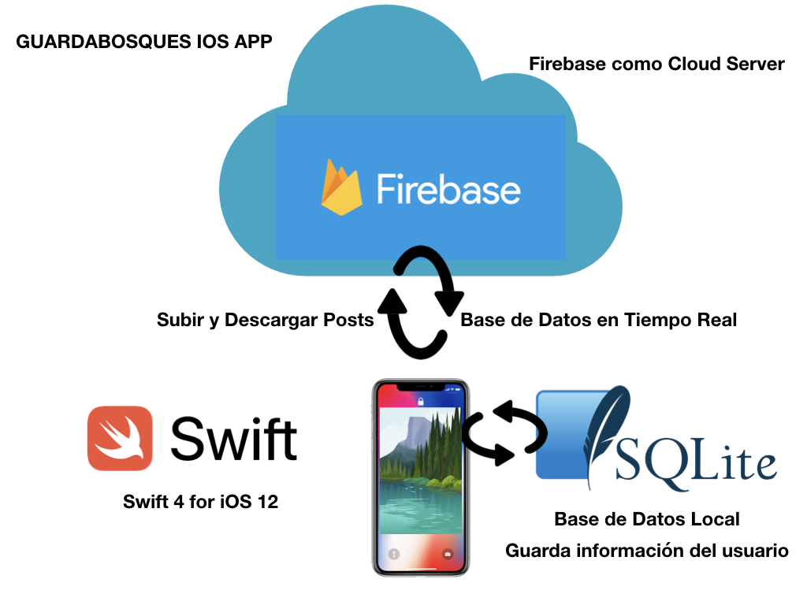
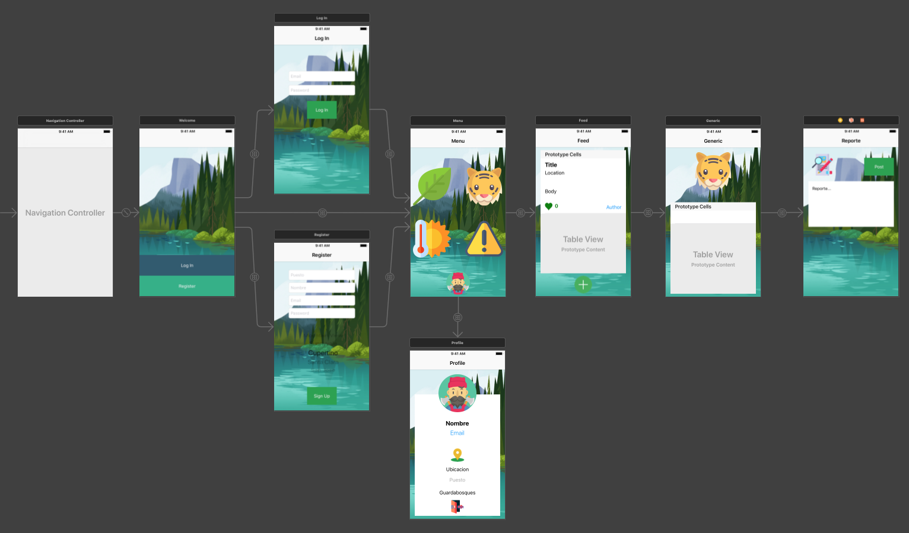

# TC3041 Proyecto  Final Primavera 2019

# Guardabosques
---

##### Integrantes:
1. Juan José Santos Chávez
2. Rafael Díaz Medina


---
## 1. Aspectos generales

### 1.1 Requerimientos técnicos

A continuación se mencionan los requerimientos técnicos mínimos del proyecto, favor de tenerlos presente para que cumpla con todos.

* El equipo tiene la libertad de elegir las tecnologías de desarrollo a utilizar en el proyecto, sin embargo, debe tener presente que la solución final se deberá ejecutar en una plataforma en la nube. Puede ser  [Google Cloud Platform](https://cloud.google.com/?hl=es), [Azure](https://azure.microsoft.com/en-us/) o AWS [AWS](https://aws.amazon.com/es/free/).
* El proyecto debe utilizar al menos dos modelos de bases de datos diferentes, de los estudiados en el curso.
* La solución debe utilizar una arquitectura de microservicios. Si no tiene conocimiento sobre este tema, le recomiendo la lectura [*Microservices*](https://martinfowler.com/articles/microservices.html) de [Martin Fowler](https://martinfowler.com).
* La arquitectura debe ser modular, escalable, con redundancia y alta disponibilidad.
* La arquitectura deberá estar separada claramente por capas (*frontend*, *backend*, *API RESTful*, datos y almacenamiento).
* Los diferentes componentes del proyecto (*frontend*, *backend*, *API RESTful*, bases de datos, entre otros) deberán ejecutarse sobre contenedores [Docker](https://www.docker.com/) y utilizar [Kubernetes](https://kubernetes.io/) como orquestador.
* Todo el código, *datasets* y la documentación del proyecto debe alojarse en un repositorio de GitHub siguiendo al estructura que aparece a continuación.

### 1.2 Estructura del repositorio
El proyecto debe seguir la siguiente estructura de carpetas:
```
- / 			        # Raíz de todo el proyecto
    - README.md			# Archivo con los datos del proyecto (este archivo)
    - frontend			# Carpeta con la solución del frontend (Web app)
    - backend			# Carpeta con la solución del backend (CMS)
    - api			# Carpeta con la solución de la API
    - datasets		        # Carpeta con los datasets y recursos utilizados (csv, json, audio, videos, entre otros)
    - dbs			# Carpeta con los modelos, catálogos y scripts necesarios para generar las bases de datos
    - models			# Carpeta donde se almacenarán los modelos de Machine Learning ya entrenados 
    - docs			# Carpeta con la documentación del proyecto
        - stage_f               # Documentos de la entrega final
        - manuals               # Manuales y guías
```

### 1.3 Documentación  del proyecto

Como parte de la entrega final del proyecto, se debe incluir la siguiente información:

* Justificación de los modelo de *bases de datos* que seleccionaron.
* Descripción del o los *datasets* y las fuentes de información utilizadas.
* Guía de configuración, instalación y despliegue de la solución en la plataforma en la nube  seleccionada.
* Documentación de la API. Puede ver un ejemplo en [Swagger](https://swagger.io/). 
* El código debe estar documentado siguiendo los estándares definidos para el lenguaje de programación seleccionado.

## 2. Descripción del proyecto

Crear una aplicación móvil que funcione como red social para todos los guarda bosques de México.
Con el fin de compartir información sobre lo que hay en su reserva, bosque o estado en el que están, la información se compartira en tiempo real por lo que para cualquier amenaza o buena noticia los guarda bosques no perderán tiempo a menos de que no tengan acceso a una red de internet.
En está aplicación se podran hacer post de 4 cosas en específico que son flora, fauna, alertas y clima (temperatura, humedad y presion).
Se incluiran las especies en peligro de extinción de flora y fauna para facilitar el acceso a ellas.


## 3. Solución

Para solucionar el problema se investigo a las especies de flora y fauna en peligro de extinción en México, también se hizo una lista de las reservas y areas protegidas de México.
Sepenso en dos diferentes bases de datos para almacenar la información de la aplicación móvil así como en que se iba a desarrollar, la mejor manera para poder registrar a todos los guarda bosques es por medio de su correo electronico.
La manera en la que se compartira la información será en momento real gracias a una conexión a internet
### 3.1 Modelos de *bases de datos* utilizados

Se escogieron dos  bases de datos que son Firebase y SQLite

*Firebase
Es una plataforma de desarrollo móvil en la nube de Google que proporciona un API para guardar y sincronizar datos en la nube en tiempo real, al mismo tiempo funciona como orquestador por lo que decidimos no ocupar Kubernetes ya que este está mejor optimizado para el desarrollo móvil.
Otras carácteristicas de Firebase son que es:

Analítica: Provee una solución gratuita para tener todo tipo de medidas (hasta 500 tipos de eventos), para gestionarlo todo desde un único panel.

Desarrollo: Permite construir mejores apps, permitiendo delegar determinadas operaciones en Firebase, para poder ahorrar tiempo, evitar bugs y obtener un aceptable nivel de calidad. Entre sus características destacan el almacenamiento, testeo, configuración remota, mensajería en la nube o autenticación, entre otras.

Crecimiento: Permite gestionar los usuarios de las aplicaciones, pudiendo además captar nuevos. Para ello dispondremos de funcionalidades como las de invitaciones, indexación o notificaciones.

*SQLite
Es una base de datos relacional compatible con ACID (Atomicidad, Consistencia, Aislamiento y Durabilidad).
Esta contenida en una relativamente pequeña biblioteca escrita en C.

Nos permite ejecutar comandos SQL en la base datos por lo que es fácil hacer consultas parametrizadas.
Otra de sus características es que el conjunto de la base de datos (definiciones, tablas, índices, y los propios datos), son guardados como un solo fichero estándar en la máquina host. Este diseño simple se logra bloqueando todo el fichero de base de datos al principio de cada transacción.

### 3.2 Modelo de Datos Firebase
### User
* UID
* Email
* Password
* Created
* Signedin

### Guardabosques
* Flora
* Fauna
* Alerts
* Weather

### Report
* Date
* Location
* MessageBody
* Title
* Username
 
 ### 3.3 Modelo de Datos SQLite
### Users
* Id
* Email
* Name
* Job
* Location


### 3.4 Arquitectura de la solución


## 3.4.1 Diagrama de las pantallas


### 3.5 Frontend

*[Incluya aquí una explicación de la solución utilizada para el frontend del proyecto. No olvide incluir las ligas o referencias donde se puede encontrar información de los lenguajes de programación, frameworks y librerías utilizadas.]*

#### 3.5.1 Lenguaje de programación
el lenguaje de programacion usado fue Swift 4
#### 3.5.2 Framework
#### 3.5.3 Librerías de funciones o dependencias

### 3.6 Backend

*[Incluya aquí una explicación de la solución utilizada para el backend del proyecto. No olvide incluir las ligas o referencias donde se puede encontrar información de los lenguajes de programación, frameworks y librerías utilizadas.]*

#### 3.6.1 Lenguaje de programación
#### 3.6.2 Framework
#### 3.6.3 Librerías de funciones o dependencias

### 3.7 API

*[Incluya aquí una explicación de la solución utilizada para implementar la API del proyecto. No olvide incluir las ligas o referencias donde se puede encontrar información de los lenguajes de programación, frameworks y librerías utilizadas.]*

#### 3.7.1 Lenguaje de programación
#### 3.7.2 Framework

## 3.8 Pasos a seguir para utilizar el proyecto
1. Clonar Repositorio
2. Navegar a la carpeta Guardabosques
3. Abir con Xcode el archivo Guardabosques.xcworkspace
4. NOTA: No confundir con el otro archivo con extension .xcodeproj
5. Con el proyecto abierto en Xcode, agregar un nuevo Bundle Identifier y un Development Team
6. Correr el Proyecto en el Simulador de Xcode con el dispositivo predilecto
## 4. Referencias
https://swift.org/documentation/
https://www.sqlite.org/docs.html
http://firebase.google.com/
